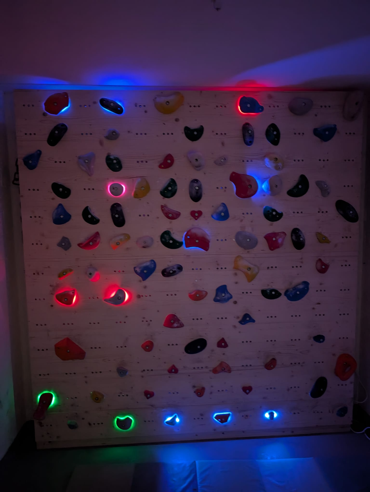

# CRUX App to WLED Bridge
This small python script is a quick and dirty Crux App to WLED Bridge. The workflow is following:

## Setup Container
To get the bridge running, I recommend using a proxy for authenticating all URLs except `https://<bridge>/viewed`.

Three commented Docker Compose examples are included:

- `docker-compose.no-proxy.yml`: publishes the bridge directly at `http://<host>:8080/`.
- `docker-compose.proxy.yml`: runs `nginxproxy/nginx-proxy` in the same Compose project and publishes the bridge at `http://<host>:8080/cruxwledbridge/`.
- `docker-compose.external-proxy.yml`: the previous setup, renamed to make it explicit that it joins an already existing `nginx-proxy` network and publishes `https://<VIRTUAL_HOST>/cruxwledbridge/`.

Start the example you want with `docker compose -f <filename> up -d --build`, for example `docker compose -f docker-compose.no-proxy.yml up -d --build`.

All examples persist the SQLite database at `/code/db/app.db` and mount the host `config` directory at `/code/app/config`. On startup, an empty config mount is initialized automatically: the bridge first copies `config.py` bundled into the image; if that file was not present while the image was built, it copies `config.example.py` as `config.py` instead. An existing `config.py` in the mount is never overwritten.

With the example Compose paths, the bridge reads `/share/Docker-Appdata/cruxwledbridge/config/config.py` on the host as `/code/app/config/config.py` in the container. If the generated file came from `config.example.py`, the bridge exits until you set the CRUX token and replace the example WLED controller (`192.0.2.10`, LEDs 0-399) with your controller configuration. Adjust the generated file and restart the bridge. If neither `config.py` nor `config.example.py` was available in the built image, or the mounted directory is not writable, the bridge prints an error and exits. Make sure the host directories are readable or writable as required by container user `1018:100`. The read-only `/etc/localtime` mount makes log timestamps use the Docker host's local timezone instead of hard-coding a timezone in the application.

For `docker-compose.proxy.yml`, `VIRTUAL_HOST` defaults to `localhost`; override it if you access the proxy with another hostname. This example mounts the Docker socket read-only so `nginx-proxy` can discover the bridge container. Docker-socket access is security-sensitive even when mounted read-only, so only use a trusted proxy image.

For `docker-compose.external-proxy.yml`, set the public hostname in a local `.env` file, for example `VIRTUAL_HOST=bridge.example.com`. The file is ignored by Git. `PROXY_NETWORK` must be the Docker network used by the external proxy and defaults to `nextcloud_proxy-tier`. Find the actual name with `docker network ls` and override it when needed, for example with `PROXY_NETWORK=myproject_proxy-tier docker compose -f docker-compose.external-proxy.yml up -d --build`.

Both proxy examples require nginx-proxy support for `VIRTUAL_PATH` and `VIRTUAL_DEST`. In the external-proxy example, the existing proxy is also responsible for TLS/certificates.

## Setup Bridge
1) Create a Gym in the CRUX App and create a wall. 
2) Get your API key from the CRUX App and insert it into `config/config.py` (there is a `config/config.example.py` as an example)
3) Configure `wled_controllers` and `hole2LEDS` in `config/config.py`. Each controller has an inclusive range of global physical LED IDs. Wall Creation assigns logical hole IDs according to the selected cable direction. `hole2LEDS` maps each logical hole to its actual physical LED IDs. This allows gaps for unused LEDs and multiple LEDs at one hold. For example, `{0: [0], 1: [2, 3]}` leaves physical LED 1 unused and assigns physical LEDs 2 and 3 to logical hole 1.
2) open `https://<bridge>/cruxwledbridge/listwalls?gym=<gymslug>` and select the wall you want to map
3) Input your grid size, then select whether the grid is standard or alternating. In alternating mode, `Columns` is the total number of possible horizontal positions and may be even or odd. Choose whether the top row is indented or not indented. For example, with `Columns=22`, each row contains 11 LEDs; with an odd number of columns, alternating rows differ by one LED. Select the location of logical hole 0 (top left, top right, bottom left, or bottom right) and whether the cable snakes horizontally through rows or vertically through columns. The default is hole 0 at the bottom left with a vertical cable run. Tap the grid corners in the order top left, top right, bottom right, bottom left and press send. You can then click individual grid positions to disable or re-enable them and save the adjusted mapping. Reopening the same `/wallcreation?id=...` URL restores the last saved corners, grid settings, cable layout, and disabled positions so the mapping can be edited without defining it again. Wall creations saved before this feature need to be defined once more so those settings can be stored. Active logical hole IDs stay contiguous in the selected cable order; `hole2LEDS` performs the separate mapping from those hole IDs to the actual physical LEDs.
4) Configure a user webhook for `climb.viewed` --> `https://<bridge>/cruxwledbridge/viewed`. If you are a gym admin, also configure a gym webhook for `climb.sent` --> `https://<bridge>/cruxwledbridge/sent` to trigger a short celebration across all LEDs whenever a climb is sent.
5) When you press on a climb, it should light up the right holes on the wall. Hold mappings are stored as `<wall_id>_<hold_id>`, so the webhook payload must include `payload.wall_id`.
6) The wall lighting can be switched at `https://<bridge>/cruxwledbridge/wall_lighting`: dark lights only the current boulder, while bright additionally lights unused LEDs dim white. The same page lets you choose the `climb.sent` celebration: moving rainbow (default), fireworks, color sparkles, rainbow party, or off. The selection is stored in the SQLite database and survives restarts. A celebration runs for 3 seconds by default, then the latest viewed boulder is restored; set `celebration_duration_seconds` in `config.py` to change the duration. The lighting mode is also available through `POST /cruxwledbridge/wall_lighting_mode` with `{"mode":"dark"}` or `{"mode":"bright"}`.
7) enjoy climbing!

## Hardware used
I use following hardware on the wall:
- LED Strips: WS2811 DC5V/12V 12mm Vollfarb-LED-Pixel-Lichterkette (https://de.aliexpress.com/item/1005009421177129.html?spm=a2g0o.order_list.order_list_main.25.6c195c5f9ulSae&gatewayAdapt=glo2deu)
- LED Controllers: GLEDOPTO ESP32 WELD LED Controller (https://de.aliexpress.com/item/1005009615006206.html?spm=a2g0o.order_list.order_list_main.20.6c195c5f9ulSae&gatewayAdapt=glo2deu)
- Appropriate 5v power supplies
- Under every hold i 3d printed a transparent pla washer to spread the LED Light. I also used a mirrorfilm on the backside of the hole to bounce off light. 
- I drilled 2x 12mm holes next to the screw-hole, with a 2.5cm spacing in between - very similar to the kilter layout. 

if you have any more questions you can reach me in the CRUX App Discord.

## Multiple WLED controllers

Add one entry per controller. Ranges must not overlap:

```python
wled_controllers = [
    {"ip": "192.0.2.10", "start": 0, "end": 399},
]
```

## Setup-Picture
Thats how it looks like after beeing finished:

