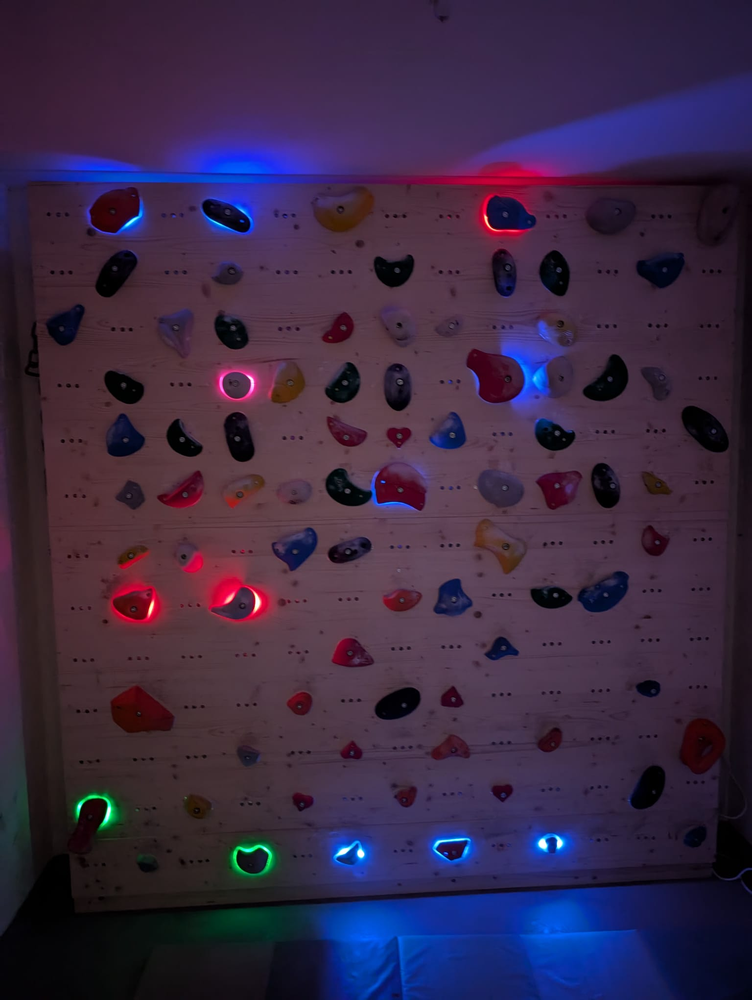

# CRUX App to WLED Bridge
This small python script is a quick and dirty Crux App to WLED Bridge. The workflow is following:

## Differences from raphirm/cruxwledbridge

This repository is based on [raphirm/cruxwledbridge](https://github.com/raphirm/cruxwledbridge), but extends it in the following areas:

- **Deployment and configuration:** Three Docker Compose variants cover direct access, a bundled nginx proxy, and an existing external proxy. Database and configuration data are persisted in dedicated directories, sub-path hosting is supported through `APP_PATH_PREFIX`, and containers use the host timezone for log timestamps. An empty config mount is initialized automatically; unchanged example values, missing templates, and unwritable mounts produce clear startup errors.
- **Flexible LED hardware:** Multiple WLED controllers can be configured with non-overlapping physical LED ranges. `hole2LEDS` separates logical CRUX hold IDs from physical LEDs, allowing unused LEDs and multiple LEDs per hold.
- **Wall mapping:** Standard and alternating grids are supported, including odd column counts and either alternating-row offset. A projective homography maps the grid between the four selected corners so photographed walls retain perspective-correct spacing. A wall image may contain multiple independently configured grids, managed as reorderable tabs for walls that turn a corner. The first tab starts at LED 0 and every following tab continues the global LED numbering. The LED cable may start in any corner and snake horizontally or vertically within each grid. New or geometrically changed grids automatically disable positions without a nearby CRUX hold by default; this behavior can be switched off and is stored separately for each grid. Every position can still be manually reactivated or disabled, with hold labels remaining attached to their physical grid positions while LED IDs are renumbered. Saved corners, layout settings, tab order, exclusions, and automatic-selection choices can be reopened and edited. Mappings are scoped by wall ID so identical hold IDs on different walls do not collide.
- **User interface:** The root URL is an English/German overview page linking to wall setup, lighting controls, and general settings. A successfully loaded gym slug is remembered locally in the browser as a directly accessible favorite and can be removed again.
- **Lighting controls and events:** Dark and bright wall modes are available, with independent 10%–100% controls for the selected boulder LEDs and the white background in bright mode. Route holds can be illuminated from below, from above, or from both sides. Above-lighting uses only an active LED exactly one row higher in the same grid column; if that position is missing or excluded, the hold retains its below light instead of using a lateral or more distant LED. One save button stores the complete lighting configuration. Lighting mode, both brightness values, hold-lighting direction, celebration effect, and the energy-saving timeout use a generic SQLite settings store that can also accept future settings, so they survive restarts. The timeout can switch an illuminated route off after a configurable number of minutes; `0` keeps it on, and every newly viewed route restarts the timer. A `climb.sent` gym webhook can trigger a configurable celebration effect, which can be disabled and restores the latest viewed climb afterward. Access logging includes useful webhook details without duplicate Uvicorn access entries.
- **Automated coverage:** Regression tests cover configuration startup, mapping layouts, multi-controller output, UI navigation, lighting modes, celebrations, and webhook behavior.

> **Maintenance rule:** Whenever behavior in this repository is added, removed, or changed relative to `raphirm/cruxwledbridge`, update this section in the same commit.

## Setup Container
To get the bridge running, I recommend using a proxy for authenticating all URLs except `https://<bridge>/viewed`.

Three commented Docker Compose examples are included:

- `docker-compose.no-proxy.yml`: publishes the bridge directly at `http://<host>:8080/`.
- `docker-compose.proxy.yml`: runs `nginxproxy/nginx-proxy` in the same Compose project and publishes the bridge at `http://<host>:8080/cruxwledbridge/`.
- `docker-compose.external-proxy.yml`: the previous setup, renamed to make it explicit that it joins an already existing `nginx-proxy` network and publishes `https://<VIRTUAL_HOST>/cruxwledbridge/`.

Start the example you want with `docker compose -f <filename> up -d --build`, for example `docker compose -f docker-compose.no-proxy.yml up -d --build`.

All examples persist the SQLite database at `/code/db/app.db` and mount the host `config` directory at `/code/app/config`. On startup, an empty config mount is initialized automatically: the bridge first copies `config.py` bundled into the image; if that file was not present while the image was built, it copies `config.example.py` as `config.py` instead. An existing `config.py` in the mount is never overwritten.

With the example Compose paths, the bridge reads `/share/Docker-Appdata/cruxwledbridge/config/config.py` on the host as `/code/app/config/config.py` in the container. If the generated file came from `config.example.py`, the bridge exits until you set the CRUX token and replace the example WLED controller (`192.0.2.10`, LEDs 0-399) with your controller configuration. Adjust the generated file and restart the bridge. If neither `config.py` nor `config.example.py` was available in the built image, or the mounted directory is not writable, the bridge prints an error and exits. Make sure the host directories are readable or writable as required by container user `1018:100`. The read-only `/etc/localtime` mount makes log timestamps use the Docker host's local timezone instead of hard-coding a timezone in the application.

For `docker-compose.proxy.yml`, `VIRTUAL_HOST` defaults to `localhost`; override it if you access the proxy with another hostname. This example mounts the Docker socket read-only so `nginx-proxy` can discover the bridge container. Docker-socket access is security-sensitive even when mounted read-only, so only use a trusted proxy image.

For `docker-compose.external-proxy.yml`, set the public hostname in a local `.env` file, for example `VIRTUAL_HOST=bridge.example.com`. The file is ignored by Git. `PROXY_NETWORK` must be the Docker network used by the external proxy and defaults to `nextcloud_proxy-tier`. Find the actual name with `docker network ls` and override it when needed, for example with `PROXY_NETWORK=myproject_proxy-tier docker compose -f docker-compose.external-proxy.yml up -d --build`.

Both proxy examples require nginx-proxy support for `VIRTUAL_PATH` and `VIRTUAL_DEST`. In the external-proxy example, the existing proxy is also responsible for TLS/certificates.

## Setup Bridge
1) Create a Gym in the CRUX App and create a wall. 
2) Get your API key from the CRUX App and insert it into `config/config.py` (there is a `config/config.example.py` as an example)
3) Configure `wled_controllers` and `hole2LEDS` in `config/config.py`. Each controller has an inclusive range of global physical LED IDs. Wall Creation assigns logical hole IDs according to the selected cable direction. `hole2LEDS` maps each logical hole to its actual physical LED IDs. This allows gaps for unused LEDs and multiple LEDs at one hold. For example, `{0: [0], 1: [2, 3]}` leaves physical LED 1 unused and assigns physical LEDs 2 and 3 to logical hole 1.
2) open `https://<bridge>/cruxwledbridge/listwalls?gym=<gymslug>` and select the wall you want to map
3) Input your grid size, then select whether the grid is standard or alternating. In alternating mode, `Columns` is the total number of possible horizontal positions and may be even or odd. Choose whether the top row is indented or not indented. For example, with `Columns=22`, each row contains 11 LEDs; with an odd number of columns, alternating rows differ by one LED. Select the location of the first LED in that grid (top left, top right, bottom left, or bottom right) and whether the cable snakes horizontally through rows or vertically through columns. The default is the bottom left with a vertical cable run. Tap the grid corners in the order top left, top right, bottom right, bottom left. Use **Add grid** when the image shows another wall section, such as a second plane around a corner; every tab has its own complete grid configuration. Drag tabs to match the physical cable order or delete one with the × button. The first tab starts at LED 0, and each later tab continues after all active positions in the previous tabs. Save all grids together. By default, positions without a CRUX hold at or near them are initially disabled for a new or geometrically changed grid. Clear **Automatically disable positions without a nearby hold** in an individual grid tab to keep all its positions; that choice is saved per grid. Review the result, click any position to disable or re-enable it, and save again. Reopening the same `/wallcreation?id=...` URL restores all tabs, their order, corners, grid settings, cable layouts, automatic-selection choices, and disabled positions. Existing single-grid mappings open as the first tab without migration. Active logical hole IDs stay contiguous across the selected tab and cable order; `hole2LEDS` performs the separate mapping from those hole IDs to the actual physical LEDs.
4) Configure a user webhook for `climb.viewed` --> `https://<bridge>/cruxwledbridge/viewed`. If you are a gym admin, also configure a gym webhook for `climb.sent` --> `https://<bridge>/cruxwledbridge/sent` to trigger a short celebration across all LEDs whenever a climb is sent.
5) When you press on a climb, it should light up the right holes on the wall. Hold mappings are stored as `<wall_id>_<hold_id>`, so the webhook payload must include `payload.wall_id`.
6) Configure wall lighting at `https://<bridge>/cruxwledbridge/wall_lighting`: dark lights only the current boulder, while bright additionally lights unused LEDs white. Separate sliders set the boulder and white-background brightness from 10% to 100%; their defaults are 100% and 20%. Route holds may use the LED below, the active LED exactly one row above in the same grid column, or both. If that exact upper position is missing or excluded, the hold uses its own below LED; the bridge never substitutes a lateral LED or one two or more rows higher. The same page selects the `climb.sent` celebration: moving rainbow (default), fireworks, color sparkles, rainbow party, or off. Use the single button at the bottom to save the mode, both brightness values, hold-lighting direction, and celebration together. These settings are stored in SQLite and survive restarts. A celebration runs for 3 seconds by default, then the latest viewed boulder is restored; set `celebration_duration_seconds` in `config.py` to change the duration. The combined API is `POST /cruxwledbridge/wall_lighting_settings` with `{"mode":"bright","bright_brightness_percent":20,"boulder_brightness_percent":100,"hold_lighting_direction":"both","celebration_effect":"rainbow"}`; the previous mode and celebration endpoints remain available and now persist their changes too. At `https://<bridge>/cruxwledbridge/settings`, the energy-saving timeout controls how many minutes a viewed route remains illuminated. The value uses the same generic SQLite settings store, every `climb.viewed` restarts the timer, and `0` disables automatic switch-off.
7) enjoy climbing!

## Hardware used
I use following hardware on the wall:
- LED Strips: WS2811 DC5V/12V 12mm Vollfarb-LED-Pixel-Lichterkette (https://de.aliexpress.com/item/1005009421177129.html?spm=a2g0o.order_list.order_list_main.25.6c195c5f9ulSae&gatewayAdapt=glo2deu)
- LED Controllers: GLEDOPTO ESP32 WELD LED Controller (https://de.aliexpress.com/item/1005009615006206.html?spm=a2g0o.order_list.order_list_main.20.6c195c5f9ulSae&gatewayAdapt=glo2deu)
- Appropriate 5v power supplies
- Under every hold i 3d printed a transparent pla washer to spread the LED Light. I also used a mirrorfilm on the backside of the hole to bounce off light. 
- I drilled 2x 12mm holes next to the screw-hole, with a 2.5cm spacing in between - very similar to the kilter layout. 

if you have any more questions you can reach me in the CRUX App Discord.

## Multiple WLED controllers

Add one entry per controller. Ranges must not overlap:

```python
wled_controllers = [
    {"ip": "192.0.2.10", "start": 0, "end": 399},
]
```

## Setup-Picture
Thats how it looks like after beeing finished:

